# 📍 Find Your Place

> **AI-powered local discovery** — search Reddit, travel blogs, Yelp, TripAdvisor and the web to surface the Top 5 places near you. No sponsored results. Real opinions.


---

## ✨ Features

- 🌍 **Automatic geolocation** — browser GPS or silent IP fallback 
- 🗺️ **OpenStreetMap discovery** — scans real nearby places via Overpass API
- 🔴 **Reddit deep-dive** — surfaces what locals actually say on reddit.com
- 🌐 **Web research** — aggregates reviews from Yelp, TripAdvisor, travel blogs & editorial sites
- 🤖 **Gemini AI synthesis** — turns raw data into structured, ranked recommendations
- 💡 **Insider tips** — practical, actionable advice pulled from reviews
- 🔗 **Source links** — every recommendation cites its sources

---

## 🚀 How It Works

The app runs a **4-agent pipeline**:

| Agent | What it does |
|---|---|
| **Geolocation Agent** | Detects your city/coordinates via browser GPS or IP lookup but gives preference if you mention place in your query |
| **Discovery Agent** | Queries OpenStreetMap/Overpass API to find relevant nearby places |
| **Research Agent** | Uses **Tavily AI** to deep-search Reddit + web reviews for each place |
| **Recommender Agent** | Uses **Google Gemini** to rank and write structured Top 5 recommendations |


---

## 🛠️ Architecture 


---

## 📸 Demo


Each recommendation card shows:
- **Why Visit** — 2–3 sentence overview
- **Highlights** — key feature chips
- **🔴 What Reddit says** — community sentiment summary
- **🌐 What the Web says** — Yelp/TripAdvisor/blog summary
- **💡 Insider Tip** — a specific practical tip
- **Source links** — clickable citations

---
##  🛠️ Architecture


---
## 🛠️ Setup & Installation

### Prerequisites
- Python 3.10+
- A **Tavily API key** → get one free at [tavily.com](https://tavily.com)
- A **Google Gemini API key** → get one free at [aistudio.google.com](https://aistudio.google.com)

---

### 1. Clone the Repository

```bash
git clone https://github.com/Srini1024/Find-Your-Place.git
cd Find-Your-Place
```

### 2. Create a Virtual Environment

```bash
python -m venv venv

# On Windows:
venv\Scripts\activate

# On Mac/Linux:
source venv/bin/activate
```

### 3. Install Dependencies

```bash
pip install -r requirements.txt
```

### 4. Create the `.env` File

Create a file called `.env` in the project root directory:

```
TAVILY_API_KEY=your_tavily_api_key_here
GEMINI_API_KEY=your_google_gemini_api_key_here
```

### 5. Run the App

```bash
python app.py
```

Open your browser and go to **[http://127.0.0.1:5000](http://127.0.0.1:5000)**

---

## 📁 Project Structure

```
Find-Your-Place/
├── app.py                   # Flask web server & API routes
├── pipeline.py              # LangGraph pipeline orchestration
├── requirements.txt         # Python dependencies
├── .env                     # ← YOU CREATE THIS (not in repo)
│
├── agents/
│   ├── geolocation_agent.py # Detects user location
│   ├── discovery_agent.py   # Finds places via Overpass/OSM
│   ├── research_agent.py    # Tavily web + Reddit research
│   └── recommender_agent.py # Gemini AI ranking & generation
│
├── templates/
│   └── index.html           # Main HTML template
│
├── static/
│   ├── css/style.css        # Styling
│   └── js/app.js            # Frontend logic
│
└── results/                 # Demo screenshots
```

---
## 🧪 Testing

Run the built-in test suite to verify agents are working:

```bash
python test_agents.py
```

Test OpenStreetMap connectivity:

```bash
python test_osm.py
```

---

## 📦 Dependencies

| Package | Purpose |
|---|---|
| `flask` | Web server |
| `tavily-python` | Web & Reddit search |
| `google-generativeai` | Gemini AI recommendations |
| `langgraph` | Agent pipeline orchestration |
| `requests` | HTTP calls to Overpass API |
| `geopy` | Geocoding utilities |
| `python-dotenv` | Loads `.env` variables |

---

## ⚙️ How Geolocation Works

1. **Browser GPS** — the app requests your device location (most accurate)
2. **IP fallback** — if GPS is denied, the app silently uses your IP address to estimate city
3. **Query-based** — if all else fails, location is inferred from your search query

---

## 📝 License

This project is for educational and personal use.

---

*Built with ❤️ using Flask, LangGraph, Tavily AI, Google Gemini and Antigravity.*
